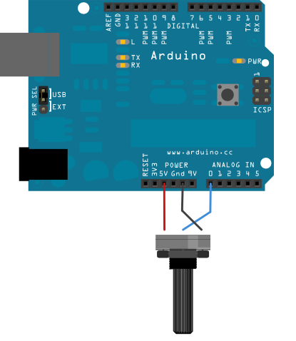

[.text-center]
This text is documented in AsciiDoc format
[.text-center]
Suggested viewer https://addons.mozilla.org/en-US/firefox/addon/asciidoctorjs-live-preview/[FireFox plugin Asciidoctor.js Live Preview]

[.text-center]
== Scilab Serial Communication Toolbox (SSCT)
:author: Foad Sojoodi Farimani
:email: f.s.farimani@gmail.com

// coderay, highlightjs, prettify, pygments
// :source-highlighter: highlightjs

== Abstract:

[.text-justify]
Scilab Serial Communication Toolbox (SSCT) is inspired by
https://github.com/sengupta/Scilab-Serial[a toolbox with a same name]
originally developed by
https://www.linkedin.com/in/adityasengupta/[Aditya Sengupta] and
http://www.weizmann.ac.il/home/fesegre/[Enrico Segre]. However,
https://github.com/Foadsf/Scilab-Serial[this new development line] is an
attempt to comply / resemble MATLAB serial communication functionalities
and syntax, as much as possible. The toolbox adds serial port
(e.g. RS-232) protocol communication to Scilab / [line-through]#Scicoslab# platforms,
which are Free, Libre, and Open Source Software (FLOSS) alternatives of MATLAB.
The toolbox can be used "for sending commands to control robots, motors,
or reading sensors such as GPS, laser scanners, compasses, etc" <<Esposito2009>>.
For the moment the toolbox only works on Wondows OS,
but development for Linux and macOS are under progress and hopefully will be added in the future.
This toolbox is still in early stage prototyping stage and functions are not compiled.
To use it just download this Gist and run the `ssctmain.sci` in Scilab.
For ScicosLab, due to the fact that multiline commenting `/* ... */` is yet to be implemented,
the AsciiDoc documentations in those tags need to be removed in advance.

[.text-justify]
A serial object structure with similar
https://nl.mathworks.com/help/matlab/matlab_external/property-reference.html[properties
/ attributes] and
https://nl.mathworks.com/help/matlab/serial-port-devices.html[functions]
of the one in MATLAB has been developed. There are of course some syntax
differences due to Scilab intrinsic limitations, not-implemented
features, as well as extra features considered to improve upon what
MathWorks has already done. Considering that Scilab doesn’t have
built-in Serial Port communication, external languages including Tcl,
PowerShell, CMD / batch, [line-through]#bash, C, C++# have been used. Moreover, due to the
lack of object oriented programing (OOP) capability in Scilab there are major
differences between this toolbox and MATLAB. Mainly the serial object
has no `routine` / `subroutine` / `procedure` accessible through dot `.`
operator, as seen in the OOP languages. Furthermore, all the MATLAB
functions starting with an `f` are changed to `s` to avoid confusion and
conflicts with other Scilab functions, as well as possible copyright issues.
For example MATLAB’s `fopen` is `sopen` in this toolbox. The syntax has been changed in a way to be more consistent and concise.

[.text-justify]
Although there are other FOSS options like Python, Octave, Julia, Sage,
Maxima, R and FreeMat ..., Scilab stands out among these options for having
the great xcos / scicos environment,
which is a replica of SIMULINK visual programing. xcos / scicos can also
include code blocks from other languages such as C/C++, Fortran, Scilab,
and Modelica language. In addition, Scilab / ScicosLab also
have a nice  GUI building functionality which resembles MATLAB
syntax. In general for users coming from a
MATLAB background it is one of the best alternatives.

[.text-justify]
The codes / texts copied from other sources have the original licensing if not specified. The text of this author is under Creative Commons License BY-NC-SA and the codes are GPLv3.

== Introduction:

A typical serial port communication session has five steps:

. Find the valid, available, open, defined serial ports using the
`slist` function
//(changing to slist?)
. Create a serial port object using the `sdefine` function, specifying
the required link:#%20Properties[properties].
// changing to sdefine or smake
. Opening the port using the `sopen` function and adjusting the properties using [line-through]#`sconfig`# and `sinfo` function
. Sending or receiving data using
.. `sput` and [line-through]#`sputl`# for putting data to the serial port buffer and `sflush` for sending them out, or alternatively [line-through]#`ssend`#/[line-through]#`ssendl`#
.. `sget` and [line-through]#`sgetl`# function for taking data out of the serial port buffer
. Closing the port using the `sclose` function and cleaning up the
`DefinedPorts` list using the `sdelete` function.

Alternatively one can use the `sprint`/[line-through]#`sprintl`# and [line-through]#`sread`#/[line-through]#`sreadl`# functions to send and
read data in one step.

=== Example:

[source,scilab]
....
s1 = sdefine(Port = "COM1", BaudRate = 4800);
sopen(s1);
sput(s1, "*IDN?");
out = sget(s1);
sclose(s1);
sdelete(s1);
clear s1;
....

or alternatively using the simpler syntax:

[source,scilab]
....
sprint(Port = "COM1", Message = "*IDN?", BaudRate = 4800);
sread("COM1"); // to be implemented
....

include::serialobject.sci[]

== Functions:

include::slist.sci[]

include::sdefine.sci[]

include::sopen.sci[]

=== sprint()

writes text to the serial devoice (similar to the MATLAB fprintf)

==== Syntax:

[source,scilab]
....
<Result> = sprint(<SerialPort => SerialPort, <Message => Message, <Mode = "syn"/"async">)
....

==== Description:

The `SerialPort` is a serial port object defined by the `serial`
function or a string of a valid serial port such as `COM1`. The
`Message` is a Scilab string which can be a formatted text created by
Scilab’s `msprintf` function or a SCPI / SCI command known to the serial
device.

==== Example:

[source,scilab]
....
sprint(s1, 'RS232?');
....

[source,scilab]
....
sprint(s1,'*IDN?');
....

[source,scilab]
....
sprint(s1, msprintf('%s','RS232?'));
....

[source,scilab]
....
sprint(s1, msprintf('ch:%d scale:%d', 1, 20e-3), 'sync');
....

=== sinfo()

Check the input and output buffer for available bytes and the status of
the port

==== Syntax:

....
[InutBytesAvailable, <OutputBytesAvailable>, <Status>, <Result>] = sinfo(SerialPort)
....

== Tutorials:

=== Example 01:

[.text-justify]
In this example (inspired by
https://www.instructables.com/id/Arduino-and-Matlab-let-them-talk-using-serial-comm/[this
tutorial]) you will learn how to communicate with an Arduino
microcontroller (MCU) expansion board and a Windows PC, through serial
port. By the end of this example you will be able to read the value of a
potentiometer, while this can be also expanded to reading any other sensors
as well. To follow along the example you require the hardware
including an Arduino Uno MCU development board, a potentiometer, wiring
and breadboard.

.Arduino Board

Alternatively you can use SimulIDE to simulate the hardware and the
Null-modem emulator (com0com) one Windows, to stablish a pair of virtual
serial ports.

The Arduino code is:

[source,cpp]
----
int potPin = A0;

long val = 0;
long val_ = 0;

void setup() {
  Serial.begin(9600);
}

void loop() {

    val = ((long) analogRead(potPin));

    if (val != val_) {
      val_ = val;
      Serial.println(val);
    }

}
----

find the port connected to the Arduino board by running the command:

[source,scilab]
....
slist(Verbose = %t, PortList = "all")
....

This will show you are the serial ports recognized by the operating
system, including the `"available"` and `"open"`s. Under `Description`
you should be able to find the Arduino serial port.

Scilab code

include::ex01.sci[]

SimulIDE model

.Click to see the source code
[%collapsible]
====
....
include::ex01.simu[]
....

====

Result:

image::pictures/ex01_pic02.gif[align="center", title-align=center, title="Live plotting of a potentiometer from Arduino"]

== Nomenclature / Glossary:

[.text-justify]
For those who are not familiar with serial communication, some terms
used in the practice can be difficult to grasp. In this section we will
try to explain those terms.

* *message*: a serial message is 1 byte or 8 bits, which is able to
represent between 0-255.
* *terminator*: indicates how a message should end. The common
terminator is a carriage return indicated as `"cr"` in this toolbox.
* *buffer*: is like a container on the on both sides of the
communication ports. The sender stores the data there before flushing
them through the port and the receiver stores them there before dumping
them over to the users space. The buffers have limited size which if
exceeds the oldest data will be discarded. The size of buffer can be set
through `InputBufferSize` and `OutputBufferSize` serial object property,
which can not exceed the maximum provided by the hardware
`MaxInputBufferSize` and `MaxOutputBufferSize`. If you do not flush/read
the data on the sender/receiver side in time it can lead to irreversible
data loss.
* *checksum*: in simple terms is basically a signature attached to each
message, known by the receiver, which can be used to verify that the
data is not garbled.
* *polling* and *streaming*: when requesting one single measurements
from a sensor, it is called polling. If we read data from the sensor
given a certain frequency it is called streaming.
* *Serial Command Interface (SCI)*: firstly used by Motorola in the
1970s, is basically a language known by the serial device (e.g. MCU) to
do certain things upon receiving certain messages.
* serial peripheral interface ( SPI )
* universal asynchronous receiver/transmitter (UART)
* USART
* Standard Commands for Programmable Instruments (SCPI)
* Transistor–transistor logic (TTL)
* *TTY*: teletypewriter, teletype, terminal
* Serial Port Profile (SPP)

== Abbreviations:

* *EIA* Electronic Industries Alliance
* *ANSI* American National Standards Institute
* *TIA* Telecommunications Industry Association
* *DIN* Deutsches Institut für Normung
* *RS* Recommended Standard
  ** *232*
    *** *DTE* Data Terminal Equipment eg. IBM computer, printer, plotter etc
    *** *DCE* Data Communication/circuit-terminating Equipment eg. modem, multiplexors, etc
  ** *422*, *449*, *485*, *530*
* *ASCII*: American Standard Code for Information Interchange

== Pinout and Signals

Connectors used to be in the form of https://en.wikipedia.org/wiki/D-subminiature[D-sub series] or https://en.wikipedia.org/wiki/Mini-DIN_connector[Mini-DIN]

Serial and Parallel ports were found in two different forms, DB-25 and DE-9 (which is mistakenly also referred to as DB-9).

port (e.g. , DB-25, DE-9 ...),voltage (TTL 5V, True RS-232 12V), communication standards (RS-232, USB), data transmission method (parallel or serial)

[width="100%",cols="^6%,^5%,^17%,^20%,^46%,^3%,^3%",options="header",]
|===
| DE-9 | DB-25 | acronym / abbreviation |            Name            |                         typical purpose                        | DTE | DCE
|   1  |   8   |           DCD          |     Data Carrier Detect    |          DCE is receiving a carrier from a remote DCE          |  in | out
|   2  |   3   |           RxD          |        Received Data       |                  Carries data from DCE to DTE                  |  in | out
|   3  |   2   |           TxD          |        Transmit Data       |                  Carries data from DTE to DCE                  | out |  in
|   4  |   20  |           DTR          |     Data Terminal Ready    |      DTE is ready to receive, initiate, or continue a call     | out |  in
|   5  |   7   |           GND          |        Common Ground       |             Zero voltage reference (signal ground)             |  -  |  -
|   6  |   6   |           DSR          |       Data Set Ready       |              DCE is ready to receive and send data             |  in | out
|   7  |   4   |           RTR          |      Ready To Receive      |              DTE is ready to receive data from DCE             | out |  in
|   7  |   4   |           RTS          |       Request To Send      |   flow control, DTE requests the DCE prepare to transmit data  | out |  in
|   8  |   5   |           CTS          |        Clear To Send       |            DCE is ready to accept data from the DTE            |  in | out
|   9  |   22  |           RI           |       Ring Indicator       | DCE has detected an incoming ring signal on the telephone line |  in | out
|      |   1   |           PG           |      Protective Ground     |                     Frame / Chassis Ground                     |  -  | -
|      |   9   |                        |                            |                                                                |     |
|      |   10  |                        |                            |                                                                |     |
|      |   11  |                        |                            |                                                                |     |
|      |   12  |          SDCD          |  Secondary Carrier Detect  |                        Tone from a modem                       |  in | out
|      |   13  |          SCTS          |   Secondary Clear To Send  |                                                                |  in | out
|      |   14  |           STD          | Secondary Transmitted Data |                                                                | out |  in
|      |   15  |           ST           |         Send Timing        |                                                                |     |
|      |   16  |           SRD          |   Secondary Received Data  |                                                                |  in | out
|      |   17  |           RT           |       receive timing       |                                                                |     |
|      |   18  |                        |                            |                            Loopback                            |     |
|      |   19  |          SRTS          |  Secondary Request To Send |                                                                | out |  in
|      |   21  |                        |                            |                            Loopback                            |     |
|      |   23  |                        |                            |                      Signal rate selection                     |     |
|      |   24  |           TT           |     Transmitter Timing     |                                                                |     |
|      |   25  |                        |                            |                                                                |     |
|===

[bibliography]
== References

- [Esposito2009] Joel M. Esposito, Tutorial: Serial Communication in Matlab, 2009, https://www.usna.edu/Users/weapsys/esposito/_files/roomba.matlab/Serial%20Communication%20in%20Matlab%20V2.doc[URL]
